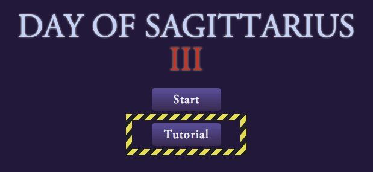
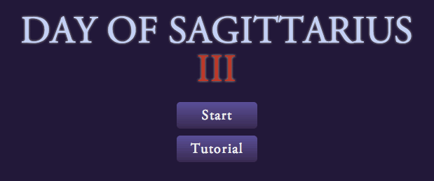
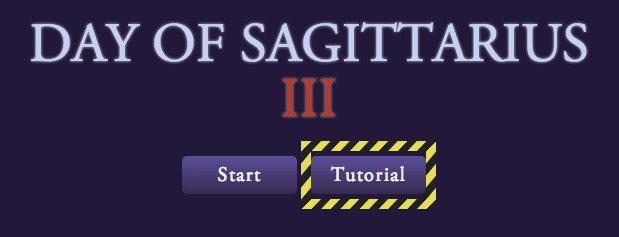

django-sneak-peek
=================

A Django template tag that allows you to hide pre-release features but make them available to a select group of users. By adding the "sneak peek" permission to users on your site, you can allow people within your company or trusted individuals to try out and experiment with upcoming features in your application.

## Requirements
* Django

	Requires Django 1.4 or higher. Currently `django-sneak-peek` does not take advantage of the built-in migrations in Django 1.7, but I'll be updating the package to add support for them once 1.7 released.

* South

	[South](https://pypi.python.org/pypi/South/0.8.4) is required for migrations. This package includes a data migration that adds a `ContentType` and an associated `Permission`. The permission is used to determine whether or not a user can view sneak peek content.

## Installation
1. Install via `pip`:

		$ pip install django-sneak-peek

2. Add `sneak_peek_tag` to `INSTALLED_APPS` in `settings.py`:

		INSTALLED_APPS = (
		    ...
		    'sneak_peek_tag',
		    ...
		)

3. Run migrations:

		$ python manage.py migrate sneak_peek_tag

4. Run `collectstatic` to grab the CSS and image:

		$ python manage.py collectstatic

## Usage
`django-sneak-peek` defines a template tag called `sneak_peek`. Markup that you want to conditionally hide must be wrapped in this template tag.

Add the `django-sneak-peek` CSS file to all pages where you plan to use the template tag:

	<link rel="stylesheet" type="text/css" href="{{STATIC_URL}}sneak_peek_tag/css/django-sneak-peek.css" />

Load `sneak_peek` in your template:

	

Wrap secret markup in `sneak_peek` tags:

	
	    

	        <h1>Secret pre-release feature</h1>
	        
	        

	            This entire div will not appear in the HTML output unless the 
	            current user has the sneak_peek permission.
	        

	    

	

## User Permissions
In order to determine whether to output the markup, `django-sneak-peek` relies on the `sneak_peek_tag.can_view_sneak_peek` permission which is installed via the included migration.

To allow a user to view sneak peek content, add this permission to their account. This can be done in the Django admin or via the shell:

	>>> from django.contrib.contenttypes.models import ContentType
	>>> from django.contrib.auth.models import Permission
	>>> 
	>>> content_type = ContentType.objects.get(app_label='sneak_peek_tag')
	>>> permission = Permission.objects.get(content_type=content_type, codename='can_view_sneak_peek')
	>>> 
	>>> user = User.objects.get(username='Homer')
	>>> user.user_permissions.add(permission)

## Additional Options
Sneak peek works by wrapping your code in a `
` and applying styles to that wrapper with the `.django-sneak-peek` class and several modifiers. Modifiers change the appearance of the sneak peek block. These modifier classes are read from the argument passed into the template tag.

Here are the available modifiers including some combinations thereof.

### Default
By default, markup will appear with a yellow & black "under construction" border. This style can also be applied explicitly by passing it as an argument (``).

	
	    

	        <button>Tutorial</button>
	    

	

### Outline
Uses an `outline` instead of a border for less box model interference.

	
	    

	        <button>Tutorial</button>
	    

	

### Borderless
Markup appears without superfluous extra styles applied by `django-sneak-peek`, but will still be surrouded by an `
` wrapper (as always). This allows for a more representative view of the sneak peek element on the page.

	
	    

	        <button>Tutorial</button>
	    

	

### Inline
Allows for easier display of inline elements by setting `display: inline;` on the sneak peek wrapper `
`.

	
	    

	        <button>Tutorial</button>
	    

	

### Inline-Block
Preferred for inline-block elements. Sets `display: inline-block;` on the sneak peek wrapper `
`.

	
	    

	        <button>Tutorial</button>
	    

	

## Customising
As you may have guessed, you can add custom display styles to `django-sneak-peek`. In addition to overriding the existing CSS classes, you can also create your own.

The `sneak_peek` template tag argument is passed directly to the `class` attribute of the sneak peek wrapper `
`.

Here's an example of a class you can add to your CSS to add custom styles to a sneak peek element:

	.django-sneak-peek.green-border {
	    border: 5px solid green;
	}

This custom class can be applied with:

	
	    ...
	

## License
